# Car rental
Car rental is a student project which is creating in order to learn basics of architecture in web applications. This project allows me to complete the course of creating mobile and web application. It is a typical CRUD application with graphical user interface.

## Database
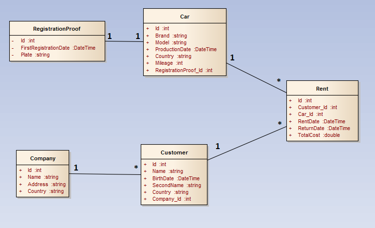
## Create
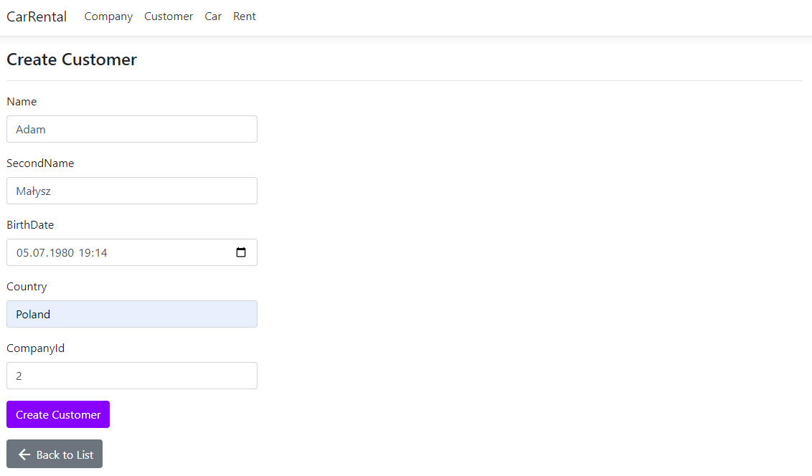
## Read
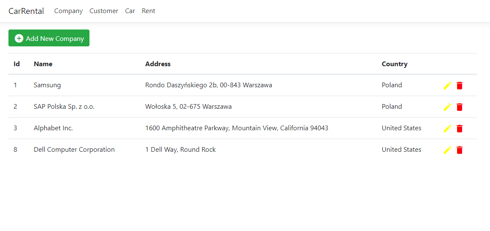
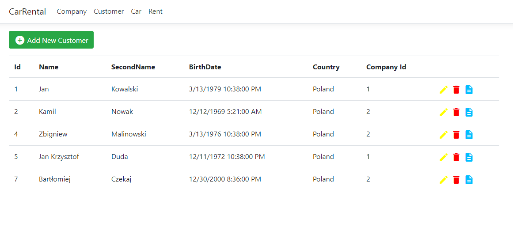
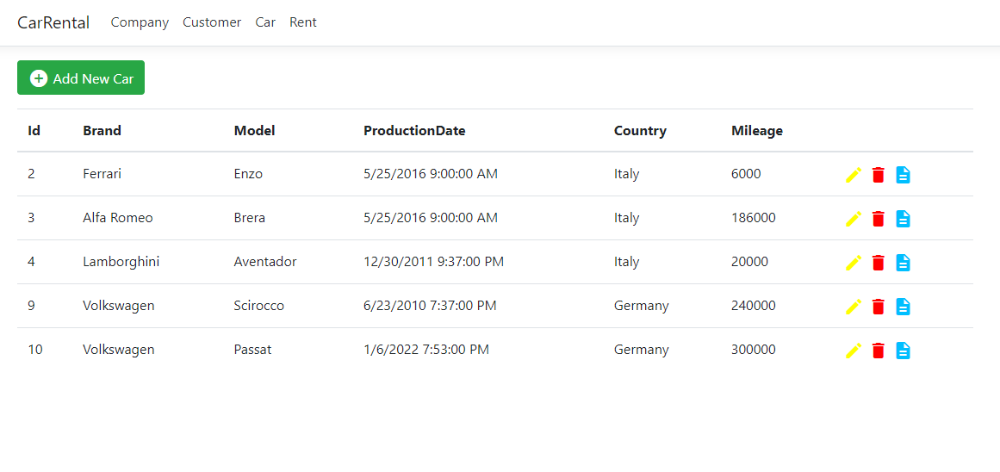
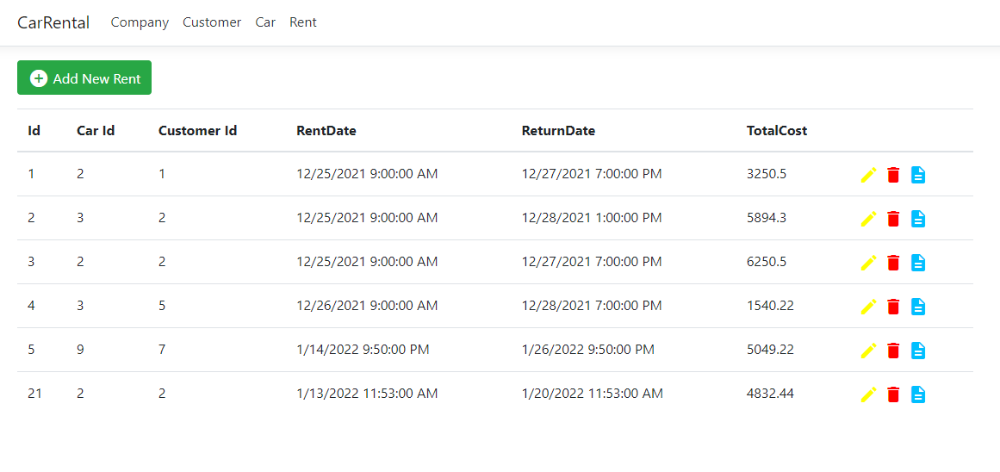
## Details
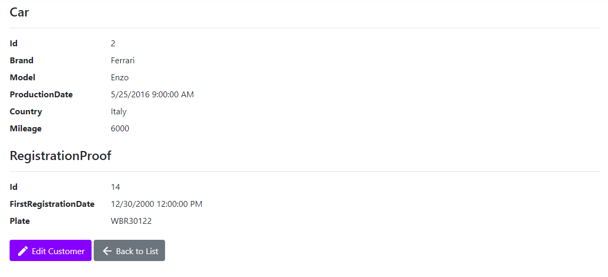
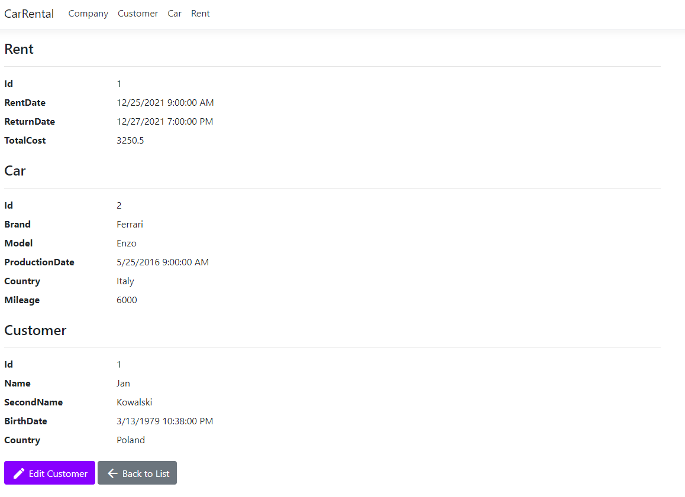
## Update
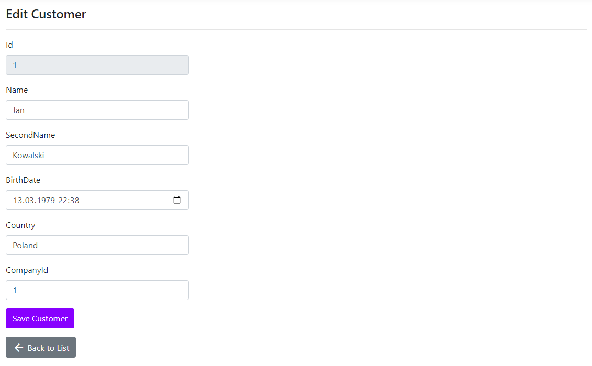
## Delete
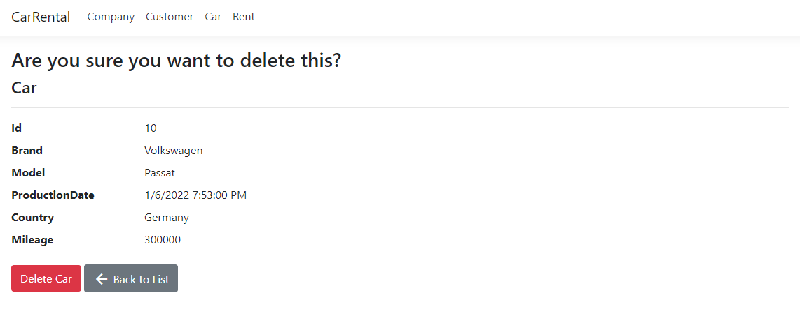
## How to run
1. Use command *dotnet run* in WebAPI folder to run API
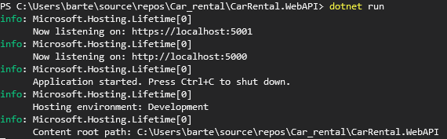
2. Check if database is connected
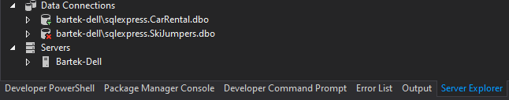
3. Run CarRental.WebApp
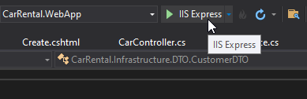
